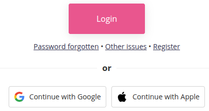
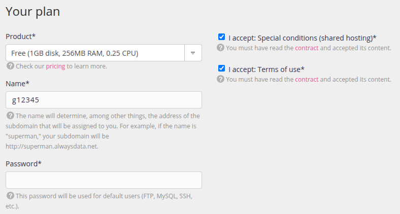
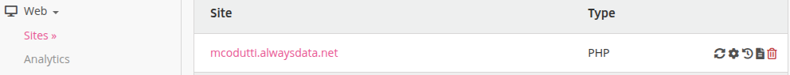

import Tabs from '@theme/Tabs';
import TabItem from '@theme/TabItem';

# TD 01 - Livrer une application

Ce TD est consacré au déploiement d’une application Spring Boot sur un serveur distant. 
Pour ce faire vous devrez empaqueter une application et utiliser 
des variables d'environnements.

### Objectifs 

À l’issue de ce TD, vous serez capable :

1. D'empaqueter (package) une application Java sous forme de fichier JAR exécutable.
1. Créer un compte AlwaysData et de configurer un environnement d’hébergement.
1. Générer une clé SSH pour sécuriser les échanges avec AlwaysData.
1. Déployer une application Spring Boot sur AlwaysData.

:::warning Pré-requis

1. Connaissance de base en Spring Boot et des commandes shell.
1. Un environnement de travail prêt avec Git, Java (JDK 21 minimum) et un IDE (VS Codium).

:::

## Analyse de l'application à déployer

Commencez par récupérer l'application Spring-Boot à déployer via 
la commande 

```
git clone https://git.esi-bru.be/4dop1dr-ressources/demo-no-db.git
```

Cette application est composée du contrôleur suivant : 

```java title="be.esi.devops.demo.rest.ServiceRestController" showLineNumbers
@RestController
public class ServiceRestController {

    @Autowired
    private Environment environment;

    @GetMapping("/config")
    public Map<String, String> getEnvironmentDetails() {
        Map<String, String> envDetails = new HashMap<>();

        // Récupération des propriétés système
        String javaVersion = System.getProperty("java.version");
        String osName = System.getProperty("os.name");
        String userName = System.getProperty("user.name");

        // Ajouter les propriétés systèmes
        envDetails.put("Java Version", javaVersion);
        envDetails.put("Operating System", osName);
        envDetails.put("User Name", userName);

        // Récupération des propriétés de configuration Spring Boot
        // depuis application.properties
        String appName = environment.getProperty("spring.application.name");
        String port = environment.getProperty("server.port");

        // Ajouter les propriétés dans la réponse
        envDetails.put("Application Name", appName);
        envDetails.put("Port Number", port);

        return envDetails;
    }
}
```

Ce contrôleur expose un service REST qui retourne des détails sur 
la configuration de l'environnement dans lequel l'application
 s'exécute. 

Le contrôleur récupère en premier les **propriétés systèmes** `java.version`, `os.name` et `user.name`.

:::info Java system property

Les propriétés systèmes ou **Java system property** sont 
initialisées lors du démarrage du JDK et dépendent de la 
configuration de l'environnement ("de la machine") de travail. 
La liste des propriétés initialisées est disponible dans la 
javadoc de la méthode `System.getProperty()`. [Consultez cette liste via ce lien et vérifiez si il est possible de récupérer le dossier de travail courant.](https://devdocs.io/openjdk~21/java.base/java/lang/system#getProperties())

:::

Ensuite le contrôleur via la classe 
`org.springframework.core.env.Environment` récupère les valeurs 
des **propriétés de configuration Spring Boot**, c'est à dire les
 variables du fichier `application.properties`.

```java title="application.properties"
spring.application.name=demo pour devops
server.port=8080
```

La première variable est un `String` représentant le nom associé à 
l'application. La seconde variable est le numéro de port associé à 
l'application.

### Exécution de l'application

Rappelez-vous, pour exécuter l'application vous avez besoin de l'outil `maven`.
Pour vérifier que l'outil est installé sur la machine, vous pouvez tenter de l'exécuter.
```
mvn --version
```
Vous devez obtenir un résultat proche de 
```
Maven home: C:\Program Files\apache-maven-3.9.10
Java version: 24.0.1, vendor: Oracle Corporation, runtime: C:\Program Files\Java\jdk-24
Default locale: en_US, platform encoding: UTF-8
OS name: "windows 10", version: "10.0", arch: "amd64", family: "windows"
```

Si `maven` n'est pas installé sur votre machine, vous pouvez l'installer
ou utiliser la version *embarquée* dans le projet.
Dans ce cas, il faudra remplacer partout la commande `mvn` par `./mvnw`.

Dans tous les cas, ne continuez pas tant qu'une erreur persiste.
Une erreur classique est l'absence de la variable d'environnement système `JAVA_HOME` voir l'absence du chemin vers le JDK dans le 
`PATH` de votre machine.

:::warning Variables d'environnement système
Une variable d'environnement système est définie au niveau du 
système d'exploitation et est accessible par tous les processus.
JAVA_HOME et PATH sont des variables d'environnement système.

On définit ces variables pour la session courante via la commande `export MY_VAR=value`.
Pour rendre la valeur permanente :
- Sous Linux/MacOS : on ajoute l'instruction au fichier `~/.bashrc`
- Sous Windows : on la définit via la fenêtre *Edit environment variables for your account* dans les settings.
:::

Vous pouvez désormais démarrer l'application avec la commande
```
mvn spring-boot:run
```

### Consommer le service REST

Pour consulter le résultat de la consommation du service rest, 
vous pouvez utiliser votre browser préféré, mais il est préférable 
d'apprendre à effectuer toutes vos actions via le terminal. 
L'objectif de cette démarche est d'apprendre un des piliers des 
pratiques DevOps, réussir à **automatiser** toutes les actions 
entreprises pour déployer une application. 

:::note Exercice

Utilisez la commande `curl` (installée à l'école) ou `curl` pour consommer 
le service `localhost:8080/config`. N'hésitez pas à tester les 
différentes options de ces commandes. Le résultat de la commande 
doit ressembler à 

```JSON
{"User Name":"g12345","Java Version":"23.0.1","Operating System":"Linux","Application Name":"demo pour devops","Port Number":"8080"}
```

Un format plus agréable est possible en redirigeant le contenu 
JSON dans `python -m json.tool` par exemple.

```JSON
{
    "User Name": "g12345",
    "Java Version": "23.0.1",
    "Operating System": "Linux",
    "Application Name": "demo pour devops",
    "Port Number": "8080"
}
```

:::

Vous pouvez à présent arrêter l'application.

## Empaqueter l'application

L'empaquetage (package) en développement logiciel consiste à regrouper tous 
les fichiers nécessaires au fonctionnement d'une application dans 
un seul fichier exécutable ou déployable. Pour les applications 
Java, cela se traduit souvent par la création d’un fichier JAR 
(Java ARchive). 
Dans un projet Spring Boot, l'empaquetage produit généralement un 
fichier JAR autonome, contenant le code de l’application, toutes ses dépendances 
et un serveur embarqué Tomcat.

:::info Tomcat

Un serveur Tomcat est un conteneur de servlets open-source développé 
par la fondation Apache. Il est conçu pour exécuter des applications 
web basées sur les technologies Java.
Lors de l'exécution d'une application Spring Boot, le serveur Tomcat 
embarqué démarre automatiquement et prend en charge les requêtes HTTP. 
Cela simplifie énormément le déploiement, car il n'y a pas besoin de 
configurer un serveur externe.

:::

Ce fichier JAR exécutable peut ensuite être lancé directement ou 
déployé sur un serveur, simplifiant le processus de distribution 
et d’exécution de l’application.

Pour réaliser l'empaquetage de l'application, exécutez la commande : 

```
mvn package
```

Vérifiez la présence du fichier `demo-1.0.0.jar` dans le dossier 
`target/` et validez l'étape d'empaquetage en démarrant 
l'application via la commande

```
java -jar target/demo-1.0.0.jar
```

Consultez le résultat de la consommation du service rest via la 
commande `wget` ou `curl` puis arrêtez votre serveur.

:::note Exercice

Dans un **même terminal** : 

1. Définissez la variable d'environnement 
système via `export SERVER_PORT=8081`.
1. Démarrez le serveur avec `java -jar demo-1.0.0.jar`.

Prenez note de l'url à laquelle répond votre application : 
`localhost:8080/config` ou `localhost:8081/config` ?

Arrêtez votre serveur et dans le **même terminal**, 
lancez la commande ajoutant 
une _Java System Property_

```
java -jar -Dserver.port=8082 demo-1.0.0.jar 
```

À quelle url répond votre application ?

Finalement lancez la commande qui ajoute en plus une propriété de 
configuration Spring Boot

```
java -jar -Dserver.port=8082 demo-1.0.0.jar --server.port=8083
```

Déduisez l'ordre de priorité entre les différentes variables
(variable d'environnement système, Java System Property et 
propriété de configuration Spring Boot).

:::

Comprendre la différence entre la portée de ces variables et leurs 
priorités est utile lorsqu'il faudra, dans le prochain TD, faire 
correspondre un numéro de port défini sur un serveur en ligne avec 
celui de notre application. 


## Préparer l’infrastructure

AlwaysData est une plateforme qui permet d'héberger des sites web, des applications et des bases de données en ligne. 
Elle prend en charge de nombreuses technologies telles que PHP, Python, Node.js, Ruby et Java. Elle est compatible avec des systèmes de bases de données comme MySQL, PostgreSQL, SQLite et MongoDB. 
De plus, elle offre un accès SSH pour une gestion avancée.

Pour déployer une application Spring Boot sur cette plateforme,
utilisez le lien que vous avez reçu de *AlwaysData* (le sujet est *Invitation AlwaysData Academic Cloud)



Choisissez de vous connecter avec *Google*



Choisissez le plan gratuit, fournissez un mot de passe et indiquez `g12345` (un `g` suivi de votre matricule) comme login.

### Installer le JDK

Une fois connecté, la page d’accueil affiche les **Sites** associés à votre compte. 
Un premier site web est créé et à la forme *g12345.alwaysdata.net*.



Testez et constatez que le site contient juste une page d'accueil basique par défaut.

:::warning

Par défaut la machine qui héberge votre site ne dispose pas d'une version du JDK installée.
[Consultez la documentation de Alwaysdata avant de passer à la suite afin de comprendre les étapes suivantes.](https://help.alwaysdata.com/en/languages/java/configuration/)

:::

Appuyez sur le bouton permettant de modifier le site &#9881;&#65039;
- Changez le *Type* en *User program*.
- Ajoutez dans le champs *Command* `java -jar demo-1.0.0.jar --server.address=:: --server.port=$PORT`.
- Dans le champs *Working directory* ajoutez `www`, qui est le dossier de travail
prévu pour votre application. 

### Activer SSH

:::info
SSH (Secure Shell) est un protocole réseau sécurisé qui permet d'établir une connexion à distance entre deux machines, généralement un ordinateur local et un serveur. Il offre une communication chiffrée pour garantir la confidentialité et la sécurité des échanges.
:::

Pour pouvoir déposer le fichier JAR de l'application, il faut définir le protocole de communication entre la machine de développement et la machine hébergée chez Alwaydata. Les deux machines vont communiquer via SSH.

1. Sur la page de votre compte, sélectionnez le menu `Remote access > SSH` dans le menu de navigation. 
Cette page liste les utilisateurs SSH associés à votre compte.
 Un utilisateur par défaut a été créé lors de la création de votre compte mais cet utilisateur n'est pas utilisable. 
1. Vérifiez que l'utilisateur créé peut bien se connecter avec un mot de passe.
1. **Vérifiez** que l'activation SSH fonctionne en ouvrant sur votre machine de travail un terminal et en exécutant la commande `ssh g12345@ssh-g12345.alwaysdata.net`.
1. Si nécessaire, confirmez cette première connexion en répond `yes` à la question `Are you sure you want to continue connecting (yes/no/[fingerprint])?`.
1. Entrez votre mot de passe quand il vous est demandé. 
1. Si la connexion est un succès, le prompt de votre terminal a changé pour `g12345@ssh2:~$` et vous pouvez consulter le contenu de la machine associée à votre compte via `ls -l`.
1. Vous devez voir deux dossier `admin` et `www`. Le dossier `www` va bientôt accueillir votre fichier JAR.
1. Entrez la commande `exit` pour vous déconnecter.

### Créer une clé SSH

Une pratique courante consiste à configurer une clé SSH.
Cette clé permet de se connecter automatiquement aux serveurs sans nécessiter de mot de passe à chaque connexion, offrant ainsi une solution pratique pour les utilisateurs réguliers.
De plus, les clés SSH sont indispensables pour automatiser des tâches avec des scripts ou des outils comme *Git*, garantissant une connexion sécurisée sans intervention humaine.

:::note Exercice

Créez une clé SSH sur votre machine en suivant [la marche à suivre via ce lien.](https://help.alwaysdata.com/en/remote-access/ssh/use-keys/#in-unix--os-x). Même sous Windows, la procédure donnée pour Linux est plus simple.

**Vérifiez** la connexion via `ssh g12345@ssh-g12345.alwaysdata.net`.
Si la connexion échoue, utilisez l'option `-v` (verbose) de la commande `ssh` pour obtenir des informations détaillées.
:::


## Déployer l'application

L’infrastructure en place, le déploiement se résume à copier l'application empaquetée dans le dossier d’accueil sur la machine hébergée en ligne en utilisant le protocole SSH. 

:::note Exercice

Utilisez la commande `scp` pour copier le fichier JAR dans le dossier `www`  et déployer l'application. 

Après le déploiement tester le résultat via la commande `wget` ou `curl` via l'url `http://g12345.alwaysdata.net/`.

Note: il y aura peut-être un petit délai, le temps que l'application démarre sur le serveur.
Vous pouvez aussi forcer un redémarrage via le bon bouton sur la page de gestion du site.
:::

