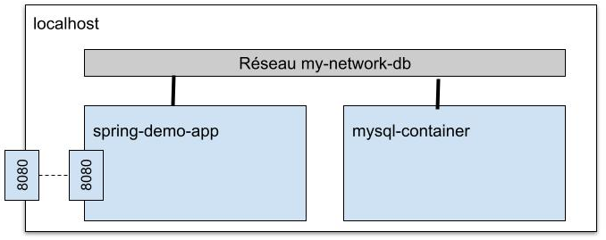

# TD 04 - Docker-compose

Vous avez maintenant acquis les bases de Docker et appris à écrire 
des Dockerfile pour créer et exécuter des conteneurs. 
Cette série d'exercices va vous permettre d'aller plus loin en explorant 
des concepts essentiels pour le déploiement et l'orchestration 
d'applications conteneurisées.

Vous commencerez par approfondir le comportement des conteneurs 
avec la différence entre `ENTRYPOINT` et `CMD`, puis vous verrez comment 
optimiser vos images Docker grâce au fichier `.dockerignore`. 

Une fois ces bases maîtrisées, vous aborderez *Docker Compose*, 
un outil permettant de gérer plusieurs conteneurs. 
Vous créerez des configurations *docker-compose.yml* pour orchestrer 
une application Spring avec une base de données MySQL.

### Objectifs 

À l'issue de ce TD, vous serez capable de :

1. Comprendre les mécanismes avancés de Docker.
1. Optimiser les images et les conteneurs.
1. Orchestrer des applications avec Docker Compose.


:::warning Pré-requis

1. Connaissance de base en Spring Boot et des commandes shell.
1. Un environnement de travail prêt avec Git, Java (JDK 17 minimum),
 un IDE (VS Codium) et Docker.
1. Connaissance de base de Docker ses images et ses conteneurs.

:::

## Docker
 
Dans cette section, vous allez approfondir certaines notions essentielles 
qui n'ont pas encore été abordées concernant Docker.

### ENTRYPOINT ou CMD

#### Etape 1 : Valeurs héritées

Lorsque vous utilisez des Dockerfiles, vous constatez
que deux instructions assez proches sont utilisées pour 
demander d'exécutez une action au démarrage du conteneur :
`CMD` et `ENTRYPOINT`.

Afin d'y voir plus clair dans la distinction entre ces 
deux directives, créez un Dockerfile à partir d'une image alpine.


```Dockerfile title="Dockerfile"
FROM alpine:latest
```

Ensuite créez l'image associée à ce Dockerfile via la commande : 

```bash
docker build -t test-no-entrypoint-no-cmd .
```

:::tip

Si vous souhaitez appeler le fichier autrement
que Dockerfile, le flag `-f` est disponible : 

```bash
docker build -f <NOM_DOCKERFILE> -t test-no-entrypoint-no-cmd .
```

:::

Enfin démarrez un conteneur basé sur cette image via la commande : 

```bash
docker run test-no-entrypoint-no-cmd
```

Le conteneur démarre et aucune action ne semble avoir été exécutée. Inspectez la configuration de l'image et **cherchez** la valeur des directives CMD et Entrypoint de ce conteneur
dans le résultat de la commande :

```bash
docker inspect test-no-entrypoint-no-cmd
```

Vous devez constater via cette inspection que la valeur de la directive **CMD** est `/bin/sh`.
Ce qui signifie que la commande `docker run` : 
- effectue la création du conteneur à partir de alpine.
- effectue l'execution de la commande `/bin/sh` dans alpine.
- arrête le conteneur dès que la commande `/bin/sh` s'arrête.

Avant de passer à la suite, effacez ce conteneur de test.

:::tip

Lorsque vous démarrez des conteneurs temporaires, vous pouvez les effacer automatiquement après leur exécution en utilisant le flag `-rm` comme ci-dessous.

```bash
docker run --rm test-no-entrypoint-no-cmd
```

:::

#### Etape 2 : CMD personnalisé

Modifiez votre Dockerfile et créez une image écrasant la directive **CMD** : 


```Dockerfile title="Dockerfile"
FROM alpine:latest

CMD ["echo", "Hello, World!"]
```

Construisez l'image `test-no-entrypoint-cmd`et démarrez
un conteneur pour tester cette image.

La commande `docker run` : 
- effectue la création du conteneur à partir de alpine.
- effectue l'execution de la commande `/bin/echo "Hello, World!"` dans alpine.
- arrête le conteneur dès que la commande `/bin/echo` s'arrête.

Si vous essayez de démarrer le même conteneur en passant
un argument comme dans la commande suivante, une erreur apparait.

```bash
docker run --rm test-no-entrypoint-cmd "r tout le monde"
```

Il semble impossible de pouvoir passer un argument à `docker run` avec cette image.

#### Etape 3 : ENTRYPOINT et les paramètres

Effacez votre conteneur et modifiez votre Dockerfile pour
ajouter la directive **ENTRYPOINT** ajoutant la possibilité de gérer des arguments.

```Dockerfile title="Dockerfile"
FROM alpine:latest  

ENTRYPOINT ["echo"]

CMD ["Hello, World!"]
```

Construisez l'image `test-entrypoint-cmd` et démarrez
un conteneur pour tester cette image.
Vous constatez que "Hello, World!" s'affiche dans
le terminal.

Si vous essayez à nouveau de passer un argument, vous constaterez que la valeur donnée à la directive **CMD**
a été écrasée.

:::info ENTRYPOINT ou CMD
**ENTRYPOINT** est utilisé pour définir un programme 
principal qui **s'exécutera toujours**, même si des 
arguments sont passés.
**CMD** définit des **arguments par défaut** pour ENTRYPOINT 
mais peut être remplacé si des arguments sont fournis à la 
commande `docker run`.
:::

Un tableau récapitulatif est disponible sur la [documentation des directives de docker](https://docs.docker.com/reference/dockerfile/#understand-how-cmd-and-entrypoint-interact).

### Optimiser la taille des images Docker

Vous avez vu comment `ENTRYPOINT` et `CMD` influencent le comportement 
d'un conteneur au démarrage. Cependant, lorsqu'on construit une image 
Docker, il est essentiel de ne pas inclure des fichiers inutiles pour 
optimiser la **taille** et la **sécurité**. C'est là qu'intervient `.dockerignore`, 
qui vous permet de contrôler ce que Docker copie dans l'image.  Ce fichier fonctionne comme un `.gitignore`.

Pour l'utiliser il suffit de créer au même niveau que le fichier `Dockerfile`, le fichier `.dockerignore`.
Ce fichier est à adapter suivant les projets. On peut
à titre d'exemple imaginer la version ci-dessous pour 
un projet développé en python : 

```bash title=".dockerignore"
# Ignorer les fichiers de configuration sensibles
# contenant des mots de passes ou des clés API
.env   

# Environnement virtuel 
venv/         

# Ignorer les fichiers temporaires et inutiles  

## Fichiers de logs (ex: `server.log`) 
*.log   
## Fichiers compilés en bytecode Python     
*.pyc  
## Fichier caché généré automatiquement par macOS      
.DS_Store    

# Ignorer les fichiers liés à Git  
## Dossier contenant l'historique Git
.git/ 
## Fichier de configuration Git         
.gitignore   

```

La commande `docker build` exclura les fichiers et dossiers mentionnés dans le ``.dockerignore``.

:::note Exercice 1 : Exclure application.properties

Dans une application Spring-boot le fichier `application.properties` peut
contenir des données sensibles tel que le mot de passe
de la base de données. Excluez ce fichier de l'image construite à
partir de l'application `demo-no-db` créée
dans le td précédent.

Comment allez-vous vérifier que ce fichier est bien 
absent des conteneurs générés à partir de cette image ? 

:::


:::tip Afin d'optimiser la taille des images Docker

- Utilisez une image de base légère (`FROM ... -alpine`).
- Utilisez un `.dockerignore`.
- Minimisez le nombre de couches (`RUN` en une seule commande).
- Utilisez le principe du **multi-stage builds**.
- Nettoyez les dépendances temporaires.
- Évitez d'installer des outils inutiles.

:::

<!-- :::note Exercice 2 : Gestion des privilèges

Modifiez le Dockerfile de l'application demo-no-db en créant un utilisateur sans les privilèges root comme conseillé à la fin du td précédent.

::: -->

## Docker compose

Gérer plusieurs conteneurs manuellement peut vite devenir complexe. 
Docker Compose simplifie cette gestion en permettant de définir et d'orchestrer 
plusieurs services dans un simple fichier YAML.

### Manipulation de YAML

Avant de pouvoir tirer pleinement parti de Docker Compose, il est essentiel de maîtriser
la syntaxe des fichiers YAML. 
Une bonne compréhension de YAML vous permettra de structurer correctement vos fichiers 
`docker-compose.yml` et d'éviter les erreurs courantes.

Le YAML est un format de données utilisé pour stocker et échanger des informations structurées. 
Les données sont représentées sous forme de paires
`clé: valeur`. Ce format utilise **uniquement** les **espaces** pour l'indentation.

```yaml title="config.yml"
# Configuration de l'application
application:
  name: "Gestionnaire de tâches"
  version: "1.0.0"
  debug: true

# Liste des utilisateurs
users:
  - name: "Alice"
    role: "admin"
    email: "alice@example.com"
  - name: "Bob"
    role: "user"
    email: "bob@example.com"

# Paramètres de la base de données
database:
  host: "localhost"
  port: 5432
  username: "admin"
  password: "secret"
```

:::note Exercice 2 : YAML et erreurs courantes

Trouvez les erreurs dans les fichiers YAML proposés ci-dessous.
Pour vous aider vous pouvez vérifier que le fichier respecte 
le format via [l'outil en ligne yamllint.com](https://www.yamllint.com/).
Vous pouvez aussi utiliser l'extension `YAML` de *Code*.

#### Exemple 1

```yaml
database:
    host: localhost
  port: 5432
```

#### Exemple 2

```yaml
users:
  - name: Alice
    role: admin
    email: alice@example.com
  - name: Bob
     role: user
```

#### Exemple 3

```yaml
description: This is a test: with a colon
```

#### Exemple 4

```yaml
message: This is a test # with a comment character
```
:::

### Docker network
Dans cette section vous allez créer les conteneurs permettant
d'utiliser l'application Spring Boot demo avec une base
de données MySql.

:::note Exercice 3 : Dockerfile pour une application Spring avec bases de données

Commencez par **écrire le Dockerfile** permettant de
lancer l'application Spring Boot `demo` via la 
commande suivante

```bash
docker run --rm \
  --name spring-boot-app \
  -p 8080:8080 \
  -e SPRING_DATASOURCE_URL=jdbc:h2:mem:testdb \
  -e SPRING_DATASOURCE_USERNAME=sa \
  -e SPRING_DATASOURCE_PASSWORD= \
  -e SPRING_JPA_DEFER_DATASOURCE_INITIALIZATION=true \
  g12345/spring-demo
```

g12345 doit être adapté à votre matricule.

:::

Une fois l'exercice terminé, vous pouvez utiliser l'image avec 
la base de données embarquée H2 **mais en changeant la valeur des variables 
d'environnements** vous pourrez l'utiliser aussi avec 
une base de données MySql démarrée à l'aide d'un conteneur.

Pour ce faire vous aller devoir suivre les étapes suivantes : 
1. créer un réseau de communication entre les conteneurs
MySql et Spring Boot.
1. créer un conteneur MySql associé à ce réseau.
1. créer un conteneur Spring Boot associé à ce réseau avec les
variables d'environnements correspondants à la base de données
MySql.

#### Créer un réseau de communication

Pour créer ce réseau il suffit d'utiliser la commande :

```bash
docker network create my-network-db
```

#### Créer un conteneur MySql associé à ce réseau

L'étape suivante consiste à démarrer un conteneur utilisant
l'image MySql, comme dans le td précédent, en le connectant à ce réseau grâce à l'option `--network` :

```bash
docker run -d \
  --name mysql-container \
  --network my-network-db \
  -e MYSQL_USER=g12345 \
  -e MYSQL_PASSWORD=secret \
  -e MYSQL_ROOT_PASSWORD=secret \
  -e MYSQL_DATABASE=mydatabase \
  -p 3306:3306 \
  mysql:9.2.0
```

Vérifiez que la base de données MySql a terminé de démarrer avant
de passer à la suite en consultant les logs du conteneur.

#### Créer un conteneur Spring Boot associé à ce réseau

Finalement, dès que la base de données est opérationnelle,
vous devez démarrer le conteneur de l'application
Spring Boot avec ses variables d'environnement via la commande : 

```bash
docker run --rm \
  --name spring-demo-app \
  --network my-network-db \
  -p 8080:8080 \
  -e SPRING_DATASOURCE_URL=jdbc:mysql://mysql-container:3306/mydatabase \
  -e SPRING_DATASOURCE_USERNAME=g12345 \
  -e SPRING_DATASOURCE_PASSWORD=secret \
  -e SPRING_JPA_DEFER_DATASOURCE_INITIALIZATION=true \
  -e SPRING_JPA_HIBERNATE_DDL_AUTO=create \
  -e SPRING_SQL_INIT_MODE=always \
  g12345/spring-demo
```

Consommez le service rest à l'adresse [localhost:8080/config](localhost:8080/config) pour vérifier que votre configuration fonctionne. 

Les deux conteneurs peuvent communiquer au travers du réseau virtuel créé.

 

Si vous obtenez le résultat attendu, supprimez les conteneurs créés avant de passer à l'étape suivante.

:::tip Suppression d'un réseau

Vous pouvez consulter les réseaux utilisés par Docker
via la commande `docker network ls`. Pour supprimer un réseau
devenu inutile il vous suffit d'utiliser la commande
`docker network rm <nom du réseau>`.

:::


### Écriture du docker-compose.yml

Docker vous a permis de démarrer un conteneur pour 
votre application, un conteneur pour votre base de données 
MySql et un réseau pour les associer. 
**Docker compose** permet quant à lui de réaliser 
toutes ces étapes en utilisant 
un seul fichier **docker-compose.yml** décrit ci-dessous.


```yaml title="docker-compose.yml"
services:
  app:
    build: ./demo
    container_name: spring-app
    depends_on:
      - db
    environment:
      - SPRING_DATASOURCE_URL=jdbc:mysql://db:3306/mydatabase
      - SPRING_DATASOURCE_USERNAME=root
      - SPRING_DATASOURCE_PASSWORD=rootpassword
      - SPRING_JPA_HIBERNATE_DDL_AUTO=create
      - SPRING_JPA_DEFER_DATASOURCE_INITIALIZATION=true
      - SPRING_SQL_INIT_MODE=always
    ports:
      - "8080:8080"
    networks:
      - app-network

  db:
    image: mysql:9.2.0
    container_name: mysql-db
    restart: always
    environment:
      - MYSQL_ROOT_PASSWORD=rootpassword
      - MYSQL_DATABASE=mydatabase
      - MYSQL_USER=myuser
      - MYSQL_PASSWORD=mypassword
    ports:
      - "3306:3306"
    volumes:
      - db-data:/var/lib/mysql
    networks:
      - app-network
    healthcheck:
      test: ["CMD", "mysqladmin" ,"ping", "-h", "localhost"]
      retries: 10
      interval: 3s
      timeout: 30s

networks:
  app-network:
    driver: bridge

volumes:
  db-data:
```

:::info Détails du docker-compose.yml

Le fichier docker-compose.yml permet de déclarer plusieurs
**services**, c'est à dire des conteneurs à exécuter 
dans l'environnement Docker Compose. 

Chacun de ces services est décrit via des clés comme : 
- **build** : Indique le chemin vers un Dockerfile qui sera 
utilisé pour construire l'image du conteneur.
- **image** : Spécifie l'image Docker à utiliser pour un service,
utile si l'image ne doit pas être construite mais existe déjà.
- **container_name** : Spécifie un nom personnalisé pour 
le conteneur.
- **depends_on** : permet de s'assurer qu'un service démarre 
avant un autre **mais** ne garantit pas que le service 
dépendant soit totalement prêt à fonctionner.
- **healthcheck** : Vérifie si un service est prêt.
- **environnement** : Définit les variables d'environnement à 
passer au conteneur.
- **ports** : Définit le mapping des ports entre l'hôte 
et le conteneur.
- **network** : Permet de connecter plusieurs services 
entre eux via un réseau Docker dédié.
- **volumes** : Permet de persister les données entre les 
redémarrages d'un conteneur en utilisant des volumes Docker.
- **restart** : Définit la politique de redémarrage d'un 
conteneur en cas d'arrêt ou d'échec.

Toutes les clés sont décrites dans 
[la documentation de docker compose](https://docs.docker.com/reference/compose-file/services/). 


Le fichier docker-compose.yml permet via la clé **networks** 
de définir des réseaux personnalisés pour connecter 
les conteneurs. 
Les accès à ces réseaux sont paramètrables via
la clé **driver**.
[Les options 
de configurations sont détaillés dans la documentation](https://docs.docker.com/engine/network/drivers/).

Ce fichier docker-compose.yml permet également de déclarer 
[les volumes utiles aux services](https://docs.docker.com/reference/compose-file/volumes/).
La clé `db-data` permet de monter
un volume dans un des dossiers de Docker sur l'hôte.
Le nom de ce volume peut être modifié via l'utilisation 
de la clé **name**. 

:::


Le fichier `docker-compose.yml` proposé peut se 
décomposé en :

- Un service `app` représentant le conteneur de l'application Spring Boot : 
  - Construit l'image à partir du Dockerfile présent 
  dans le dossier `./demo`.
  - Intitule le conteneur `spring-app`.
  - Dépend du conteneur intitulé `db`.
  - Définit les variables d'environnement pour la connexion MySQL.
  - Expose le port `8080`.
  - Se connecte au réseau `app-network`.

- Un service `db` représentant la Base de données MySQL : 
  - Utilise l'image disponible sur Docker Hub `mysql:9.2.0`.
  - Intitule le conteneur `mysql-db`.
  - Redémarre automatiquement en cas d'arrêt.
  - Configure une base de données `mydatabase` avec un utilisateur `myuser`.
  - Expose le port `3306`.
  - Stocke les données MySQL dans un volume `db-data`.
  - Vérifie que MySQL est prêt avant que l'application ne démarre.

- Une configuration générale : 
  - Un réseau `app-network` : 
    - Permet la communication entre les conteneurs `app` et `db`.
    - Le driver **bridge** signifie que les conteneurs connectés 
      à ce réseau peuvent communiquer entre eux mais ne sont 
      pas directement accessibles depuis l'extérieur sauf 
      via les ports explicitement exposés.
  - Un volume `db-data` : 
      - Évite la perte des données MySQL après l'arrêt des conteneurs.

Adaptez le nom du dossier présent dans la clé `build` 
du fichier `docker-compose.yml` et essayez 
d'utiliser ce fichier avec la commande 
`docker-compose up`. 
Vous devriez pour consommer le service rest de l'application 
demo à l'adresse [localhost:8080/config](localhost:8080/config).

:::info Exposer le port de mysql

Tiens, pourquoi avoir exposer le port de mysql dans le fichier *yaml* ?

:::

Si ce test est concluant supprimez les éléments créés par 
Docker compose via la commande `docker-compose down`.

